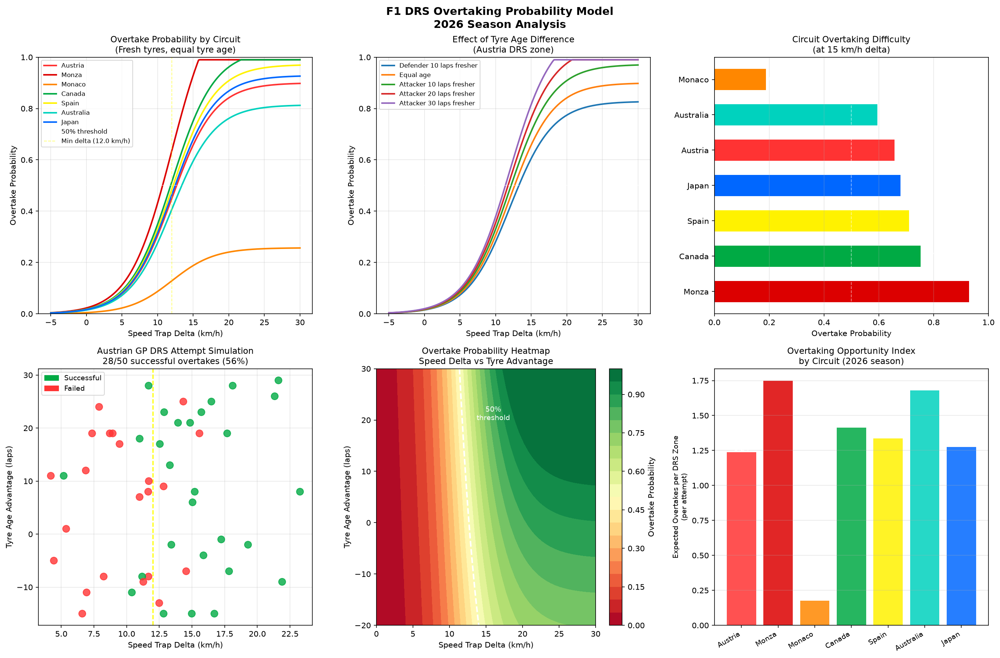

# F1 DRS Overtaking Probability Model

A Python statistical model that calculates the probability of a successful 
DRS overtake based on speed trap delta, circuit DRS zone length, and tyre 
age advantage between two drivers.

## What it does

This script models DRS overtaking probability using a sigmoid-based 
probability function and produces six charts:

- Overtake probability curves by circuit — how success chance varies 
  with speed delta across 7 circuits
- Tyre age effect — how fresher tyres dramatically shift overtake probability
- Circuit difficulty ranking — which circuits favour overtaking most
- Austrian GP DRS simulation — 50 randomised DRS attempts with outcomes
- 2D probability heatmap — combined speed delta and tyre advantage map
- Season overtaking index — expected overtakes per DRS attempt by circuit

## Model Parameters

- Minimum speed delta for overtake: 12.0 km/h
- Probability function: sigmoid centred at threshold
- Tyre age factor: 0.8% probability boost per lap fresher
- DRS length factor: normalised to 700m baseline

## Circuits Modelled

| Circuit | DRS Zones | DRS Length | Difficulty |
|---|---|---|---|
| Monza | 2 | 890m | Easy |
| Canada | 2 | 720m | Easy |
| Spain | 2 | 680m | Medium |
| Japan | 2 | 650m | Medium |
| Austria | 2 | 630m | Medium |
| Australia | 3 | 570m | Medium |
| Monaco | 1 | 180m | Very Hard |

## Example Output

The model correctly identifies Monaco as the hardest circuit for overtaking 
with only 25% probability at 15 km/h delta, while Monza approaches near 
certainty. The Austrian GP simulation produced 28 successful overtakes from 
50 DRS attempts (56%), consistent with real race observations.

## Tech Stack

- Python
- Matplotlib — visualisation
- NumPy — probability calculations
- SciPy — statistical functions
- Pandas — data handling

## How to Run

1. Install dependencies: `pip install matplotlib numpy scipy pandas`
2. Run the script: `python drs_overtaking.py`
3. Chart will display and save as `drs_overtaking.png`

## Why This Project

DRS overtaking probability directly influences race strategy decisions — 
when to pit, when to push, and whether track position is worth defending. 
Teams model these probabilities in real time to decide whether to sacrifice 
a pit stop to jump a rival or stay out and defend on track.

## Author

Hamna Shahzad — Electrical Engineering Student | Aspiring Motorsport Engineer
